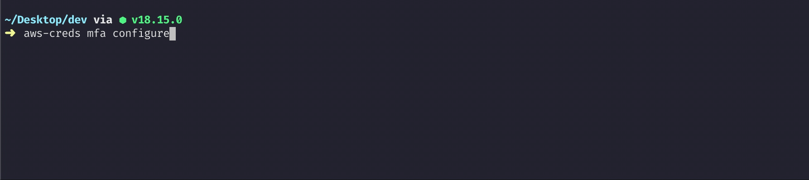
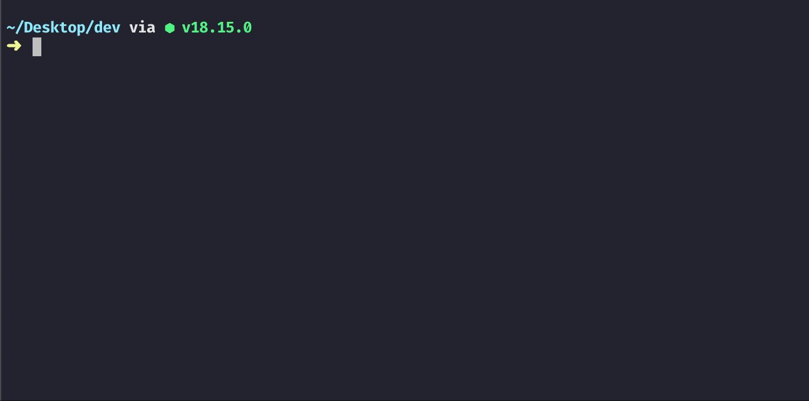
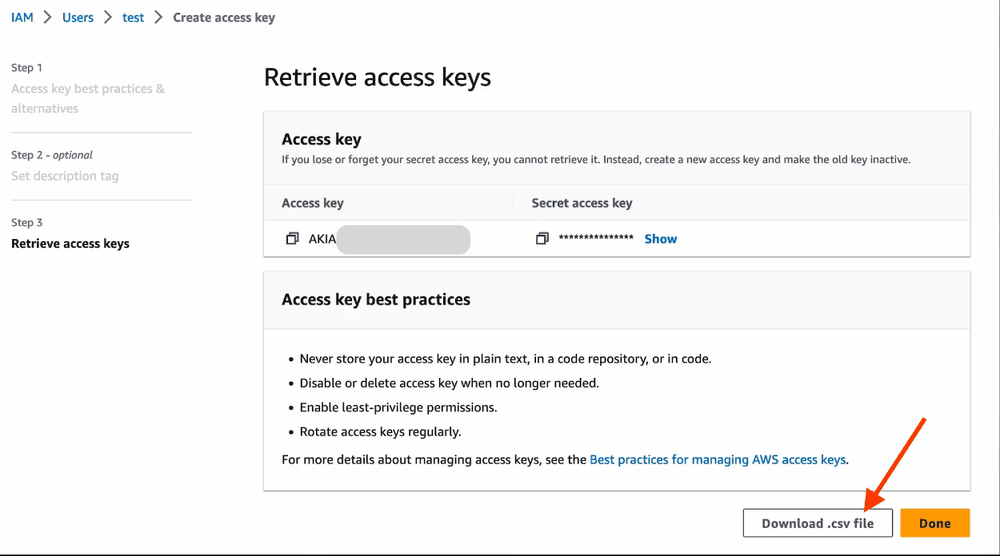
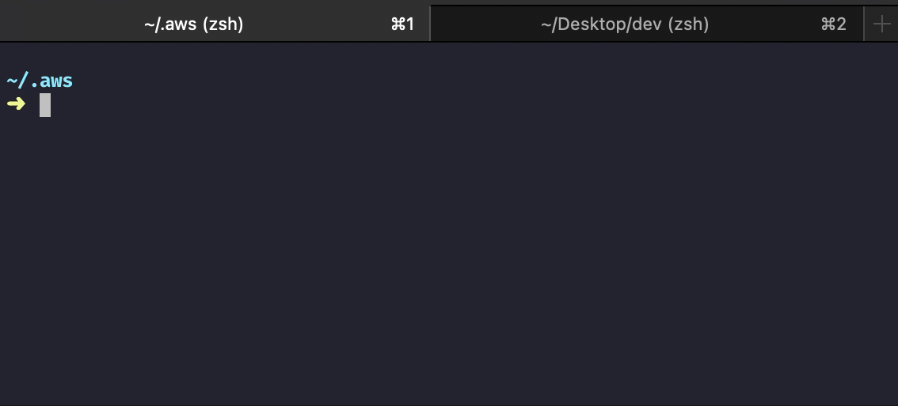

<h4 align="center">
    <a href="https://github.com/tsacademy0/aws-creds">
        
    </a>
    <br>
    <br>

⚙️ Manage AWS Credentials ⚙️

<a target="_blank" href="https://www.npmjs.com/package/@tsacademy/aws-creds"></a> <a target="_blank" href="https://tsacademy0.gumroad.com/l/aws-creds"></a> <a target="_blank" href="https://twitter.com/tsacademy0/"></a>

</h4>

<br>

# aws-creds

#### Basic Features 🎯

- Manage AWS Credentials to use with **AWS CLI** and **AWS SDKs**
- Handles both **Long-Term** or **Temporary Credentials** with a single command
- Create **AWS CLI profile** to store the AWS credentials
- Store AWS credentials into **Environment variables**
- Identify **details about the currently used AWS Credentials**

#### Premium Features 🚀

- Get **MFA authenticated credentials** and configure them into a CLI profile
- **List** AWS CLI profiles on the machine
- **Delete** an AWS CLI profile
- **Import IAM user's credentials** downloaded from the IAM console (in CSV format) into a CLI profile
- **Backup** the `.aws/credentials` file
- **Import** `.aws/credentials` file's **backup** into a new machine

#### For all the premium features do check out <a target="_blank" href="https://tsacademy0.gumroad.com/l/aws-creds">aws-creds PRO 🙌</a>

<!-- <br>

[](https://www.youtube.com/watch?v=YOUTUBE_VIDEO_ID_HERE) -->

<br>

## Prerequisites ⚠️

```
 Node.js version >= 12
```

<br>

## Install 💾

```sh
# Install globally (recommended).
npm install -g @tsacademy/aws-creds
```


<br>

## Usage 🕹

### Basic Features 🎯

#### 1️⃣ set

###### Store AWS Credentials into an AWS CLI Profile or in Environment varibales

```sh

aws-creds set
```


#### 2️⃣ curr

###### Return the "Credentials source", "Account ID" and "IAM entity" of currently used credentials

```sh
# Return details either for credentials in env variables if present, else from the 'default' CLI profile
aws curr

# Return details for a specific CLI profile
aws curr --profile <profileName>
```


#### 3️⃣ help

###### Display the help data.

```sh
corona help

corona --help
```


---

### Premium Features 🚀 ( Available with <a target="_blank" href="https://tsacademy0.gumroad.com/l/aws-creds">aws-creds PRO</a> )

#### 1️⃣ list-profiles

###### Get list of AWS CLI profiles configured in the .aws/credentials file

```sh
aws-creds list-profiles
```


#### 2️⃣ delete-profile

###### Delete an AWS CLI profile configured in the .aws/credentials file

```sh
aws-creds delete-profile
```


#### 3️⃣ mfa

###### Get MFA Authenticated credentials

**Note:** The process mentioned in the following [AWS article](https://repost.aws/knowledge-center/authenticate-mfa-cli) is automated by this feature to easily get MFA authenticated credentials.

```sh
# ⭐️ Called once ⭐️ for a specific credential to configure MFA related configuration
aws-creds mfa configure
```



```sh
# Issue and store MFA authenticated AWS credentials into an AWS CLI profile
# AWS CLI profile created with following name: ${profileName}-mfa
aws-creds mfa
```



#### 4️⃣ import

###### Import IAM user's credentials downloaded from IAM console (in CSV format) into a CLI profile

```sh
aws-creds import
```



#### 5️⃣ backup

###### Backup `.aws/credentials` file

```sh
aws-creds backup
```


#### 6️⃣ import-backup

###### Import `.aws/credentials` file's backup into a new machine

```sh
aws-creds import-backup
```



## License & Conduct

- MIT © [Troubleshooting Academy](https://twitter.com/tsacademy0/)
- [Code of Conduct](https://github.com/tsacademy0/aws-creds/blob/master/CODE-OF-CONDUCT.md)
